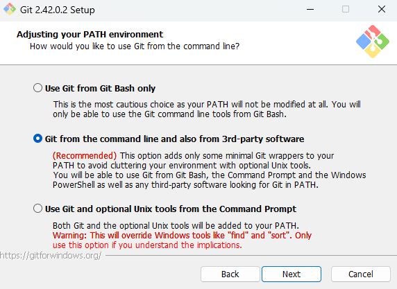
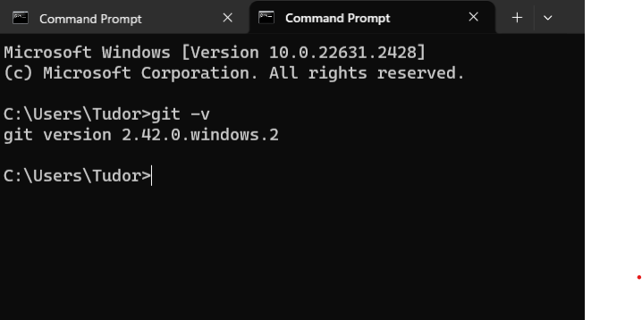
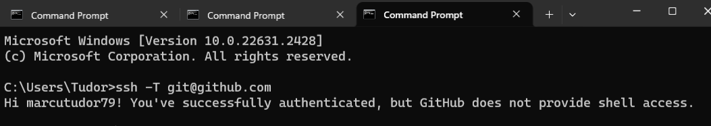
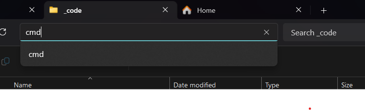
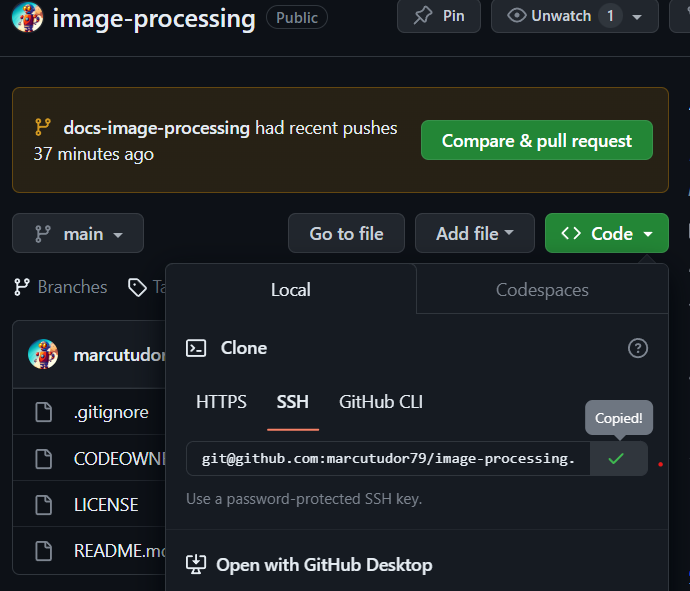

# Medical imaging ETTI project


## Setup GIT
1. Download git from [here.](https://git-scm.com/downloads)
2. Run the executable and be sure at this step to select the second radio button.

<p>      </p>
<p> The reason behind this is to add git to the PATH </p>

3. Just go with the default settings for the rest of the setup
4. Open a console, "Windows Terminal" or "cmd" if you are using Windows
5. Type the command in the console and then run it
```
    git -v
```
6. If you see the following message, then the setup completed with succes!
<p>   </p>

7. If you don't see this message in the console, please reboot your system.

## Setup SSH git clone
1. Follow the tutorial from [here.](https://leangaurav.medium.com/setup-ssh-key-with-git-github-clone-private-repo-using-ssh-d983ab7bb956)
2. Please be aware that in windows you don't need to use the cat command in order to open a file, you can just open with notepad
3. After completing the tutorial, check if the SSH connection is working as in [this tutorial.](https://docs.github.com/en/authentication/connecting-to-github-with-ssh/testing-your-ssh-connection)
4. If you don't receive the message from the picture below, then something is not working
<p>   </p>

Reason for doing the SSH clone setup: It is easier to work with github in this manner, because you won't be asked for the credentials everytime you push something to the remote repository.

## Git and Github intermezzo

Git is the versioning tool used to make "commits" on the code files or any other files. It works in three simple steps:

1. Register a file creation.
2. Register every change made to that file.
3. Profit!

Now the programmer has the ability to revert to any "commited" version of the file any time he wants. You can imagine that you can't CTRL+Z a file with 500 words until the 1 word was written in the file.

With Git you can do this!

Github is not a versioning tool! Github is just a solution offered by Microsoft to store the data that the Git tool is using, that being all the files inside a repository. A repository is just a programmer way of saying folder.

For a better comparison, you can refer to this [brief article.](https://www.geeksforgeeks.org/difference-between-git-and-github/)

## Cloning the repository

1. Create a folder in which you want to host your repo.
    - Suggestion of file structure: "D:\_code\image-processing"
2. ! You do not have to create the "image-processing" folder, it will be created automatically after cloning the repo from Github !
3. Open a console in the "_code" folder by typing "cmd" in the address path bar.

<p>   </p>

4. Copy the SSH link from Github.


<p>   </p>

5. Clone the repo by using the command.
```
    git clone git@github.com:marcutudor79/image-processing.git
```

6. Now you should see all the files from the repo locally on your computer.

## Keeping the repo up to date
1. Please note that Git does not keep the files up to date with the ones from the repo (that could be dangerous).
2. You can update your local files by running the command in a console opened inside the repository folder.
```
    git pull
```
This command will automatically download and merge all the files from Github to your local folder

3. OPTIONAL: You can update ONLY your local file history with the one from Github by running the command
```
    git fetch
```
This command will only bring the differences from Github in your local repo, so that it knows that something changed on the remote repository from Github.

4. Additional references can be found [here](https://www.geeksforgeeks.org/git-difference-between-git-fetch-and-git-pull/).