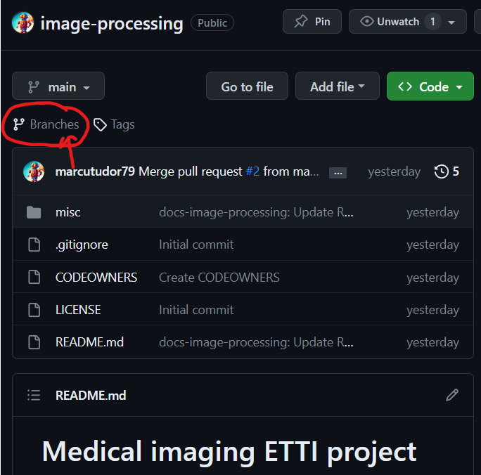
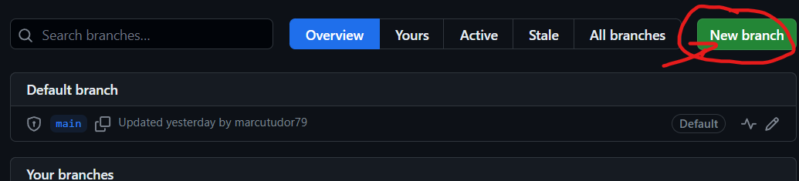
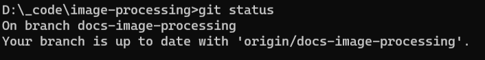
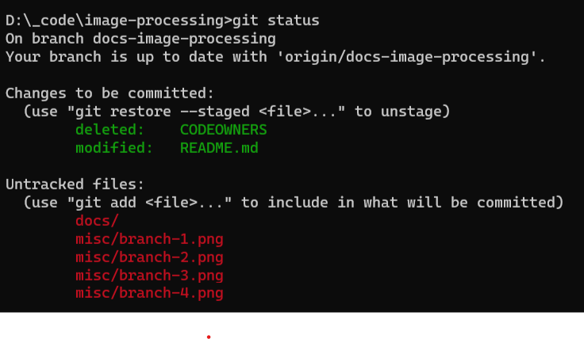

# Git tutorial

There is the mentality of working on a project: to have a "main" branch with the latest working code and documents.

If someone wants to improve the documents or the code, he should create a "branch" which is a copy of the "main" branch which does not affect the state of the "main" branch.

- This is a good option considering that the changes that you want to make are not considered optimal by the others and they can be further worked on without affecting the "main".
- This is a good option because it also preserves the "main" branch which is considered optimal by all the other programmers working on the software / documents.
- So at any given time there is the backup solution which is the "main" branch, which can be also considered the latest working software.

Keep in mind that a programmer should branch frequently, "git pull" frequently and "git push" as little as possible.

References can be found at [https://www.w3schools.com/git/git_branch.asp](https://www.w3schools.com/git/git_branch.asp).

## So how do you create a branch?

1. Go to the repository and click on the "Branches" menu.
<p>  </p>

2. Click on the "New branch" button.
<p>  </p>

3. Select the source the "main" branch and name it by the following rules

```
    <prefix>-<title-of-issue>

    where <prefix> can be: - docs (if the branch improves the documentation of the repo)
                           - software (if the branch improves the software in the repo )
    where <issue> can be:  - add-image-load-function
                           - add-pattern-recognition

    An example of branch name can be: docs-improve-README
                                            or
                                      software-refactor-function

    ! the names MUST be in lowercase and all the words separated
      by a dash "-" !
```


4. After the branch was created, open a console in your local repository.

5. Run the command that will bring the remote changes into your local repository.
```
    git fetch
```
6. Run the command that will change the local repository branch to the new branch
```
    git checkout <branch-name>
```

7. Run the command in order to see on which branch you are currently working.
```
    git status
```

<p></p>

- It should show in the console "On branch name-of-your-branch"
- The "origin/name-of-your-branch" is showing you that in the origin (that being Github), there is also a branch with the same name of the local one, which is correct considering that we fetched the name locally with the git fetch command.
- The lowercase naming scheme is necessary in order to reduce the typing overhead, also "-" is faster to write than "_".

## How to upload your work to Github

After solving the issue on the new created branch, it's time to push it to the remote branch. Keep in mind that everytime you make a change locally, unless it is pushed, it won't be visible in the remote repo.

1. Run the command that will show you what documents were modified
```
    git status
```
2. If the document is untracked by git, meaning that it does not exist in the remote repository, you can run the command to add it
```
    git add <path-to-untracked-file>
```
3. Run the command to add the other modified files
- adds all the tracked files that were modified
```
    git add -u
```
- you can add just one tracked file that was modified
```
    git add <path-to-tracked-file>
```
4. After adding the files that you want to update / upload on the remote repository, they are shown in green after running the command "git status".
<p></p>

5. Run the command in order to mark the timeline
```
    git commit
```

6. Now a text editor popped up, waiting for a message to be added. A good commit message is composed of:
```
    Commit message title:          // in which you sumarize what you did
    (2 enter must be added in order to finish the title and begin the commit message body)
    - More info about what I did
    - More info about what I did part 2
    - More info about what I did part 3
```
- For example:
```
    Update README:

    * Add links to the new README files
    * Create README file with tutorial for git
    * Create README file with setup tutorial
```

7. Now push the commit to the remote repository by runnig the command
```
    git push
```

More references ca be found at:
- [https://www.atlassian.com/git/tutorials/syncing/git-push](https://www.atlassian.com/git/tutorials/syncing/git-push)
- [https://www.atlassian.com/git/tutorials/saving-changes/git-commit](https://www.atlassian.com/git/tutorials/saving-changes/git-commit)
